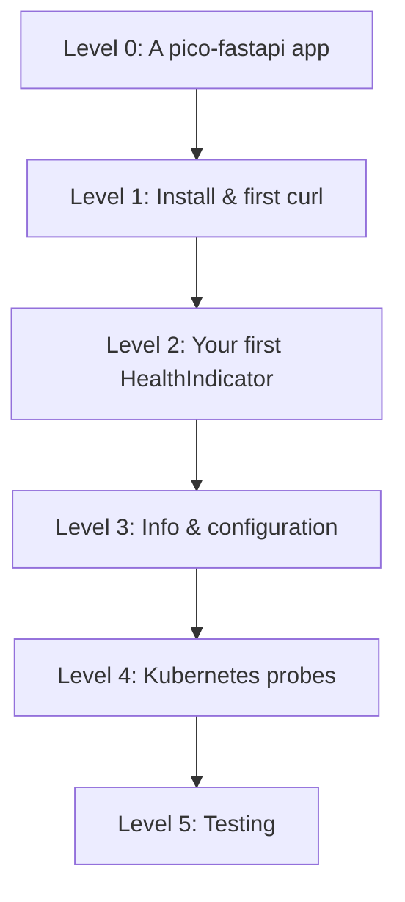

# Learning Roadmap

From zero to production probes in about 15 minutes.



## Level 0: Prerequisites

A working pico-fastapi application booted through pico-boot:

```python
from fastapi import FastAPI
from pico_boot import init

container = init(modules=["myapp"])
app = container.get(FastAPI)
```

If you do not have one yet, start with the
[pico-fastapi docs](https://dperezcabrera.github.io/pico-fastapi/) or the
[`examples/minimal/`](examples.md) app in this repo.

## Level 1: Install & first curl

```bash
pip install pico-actuator
uvicorn myapp.main:app &
curl localhost:8000/actuator/health
# {"status":"UP","components":{}}
```

No code changed — the `pico_boot.modules` entry point did the wiring.

## Level 2: Your first HealthIndicator

```python
from pico_ioc import component

@component
class DbHealth:
    name = "db"

    def __init__(self, engine: Engine):
        self.engine = engine

    def check(self):
        self.engine.connect().close()
        return {"status": "UP"}
```

Re-curl `/actuator/health` — the `db` component appears. Kill the database —
the endpoint answers `503` with `"db": {"status": "DOWN", "error": ...}`.

Read: [User Guide](user-guide/index.md) for return-value forms and failure
isolation.

## Level 3: Info & configuration

```yaml
# application.yaml
actuator:
  show_components: true
  info:
    app: my-service
    build: "2026.06"
```

Dynamic entries come from `InfoContributor` components. Read:
[Getting Started](getting-started.md).

## Level 4: Kubernetes probes

Wire `/health/live` into `livenessProbe` and `/health/ready` into
`readinessProbe` — and understand why they must not be swapped. Read:
[Kubernetes Probes](how-to/kubernetes-probes.md) and
[ADR-004](adr/adr-0004-dependency-free-liveness.md).

## Level 5: Testing

Unit-test indicators as plain classes; end-to-end test the endpoints by
booting a real container with `TestClient`. Read:
[Testing](how-to/testing.md).

## Where to go deeper

- [Cookbook](cookbook/README.md) — database indicators, caching checks,
  securing the endpoints
- [Architecture](architecture.md) and the [ADRs](adr/README.md) — why it is
  built this way
