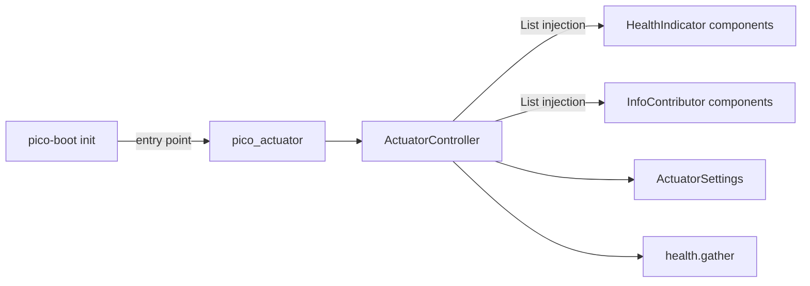

# Architecture

## Components

Four small modules, one responsibility each:

| Module | Responsibility |
|---|---|
| `controller.py` | HTTP layer — routes, status codes. A pico-fastapi `@controller`. |
| `health.py` | Pure aggregation logic. No FastAPI, no pico-ioc imports. |
| `config.py` | `ActuatorSettings` + the two protocols. |
| `exceptions.py` | `PicoActuatorError`. |

## Design decisions

**Reuse pico-fastapi's `@controller` instead of an `APIRouter`.**
Route wiring, DI resolution and result normalization (the `(body, status)`
tuple) are inherited for free, and the controller is a regular component —
overridable in tests like any other.

**Protocols + `List[...]` injection instead of a registry.**
`HealthIndicator` and `InfoContributor` mirror the `FastApiConfigurer` idiom:
implement the protocol, mark the class `@component`, done. No decorators to
import, no registration order to think about.

**`health.py` stays pure.**
The aggregation logic imports nothing from the web stack, so it is
unit-testable without booting an app — and reusable if a non-HTTP transport
ever needs it.

**Failure isolation over fail-fast.**
One broken indicator reports `DOWN` with its error; the endpoint itself never
500s. An actuator that dies with its dependencies is useless exactly when you
need it.

**Liveness is dependency-free by design.**
`/health/live` returns `UP` unconditionally: it proves the event loop answers,
so orchestrators restart genuinely hung processes — not processes whose
database blinked.
